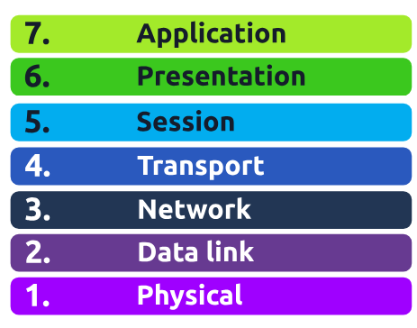

# TryHackMe: OSI Model Room

**URL:** https://tryhackme.com/room/osimodel

---

## Objective

To learn and understand the OSI (Open Systems Interconnection) model layers and how they apply to networking concepts and protocols.

---

## Overview

The OSI model divides computer networking into seven distinct layers, each with specific responsibilities:

1. Physical  
2. Data Link  
3. Network  
4. Transport  
5. Session  
6. Presentation  
7. Application

This room walks through each layer with interactive questions and examples.

---

## What I Learned

- The **Physical layer** deals with raw bits and hardware (cables, switches).  
- The **Data Link layer** handles MAC addresses and frames (Ethernet).  
- The **Network layer** routes packets using IP addresses.  
- The **Transport layer** manages end-to-end communication (TCP, UDP).  
- The **Session layer** establishes and maintains sessions.  
- The **Presentation layer** translates data formats and encrypts/decrypts.  
- The **Application layer** provides network services directly to user apps (HTTP, FTP).

- 

---

## Key Takeaways

- Understanding OSI helps in troubleshooting by narrowing down where problems occur.  
- Protocols and technologies often span multiple OSI layers.  
- Practical networking knowledge requires knowing how these layers interact.

---

## Example Questions & Answers

- *Q:* What layer is responsible for routing?  
  *A:* The Network layer (Layer 3).

- *Q:* At which layer do MAC addresses operate?  
  *A:* Data Link layer (Layer 2).

---

## Screenshots

Include any helpful screenshots you took during the room, like diagrams or tricky questions.

---

## Next Steps

Plan to explore related topics like TCP/IP model, Wireshark packet analysis, and real-world troubleshooting.

---

*This foundational knowledge is critical for progressing in networking and cybersecurity!*

